## About Me


Jiajia Wu

PHD Candiate

Biomedical Engineering

Northwestern University


## Education Background

**Northwestern University**  
PHD in BME         
`I focus on ...`    
```  ̄\_(ツ)_/ ̄ which is more promising ```

**MSU**  
Bachelor in Electrical Engineering, Biomedical Concentration\
Honors College Member\
Minor in Cognitive Science\
GPA 3.7/4.0

## Technical Skills

**Electronics & Computer Lab**

* Analog & Digital Circuit Design, AutoCAD, NX CAD & 3D printing, G-Codes & Robotics, PLC design, PSPICE, VHDL, Cadence Virtuoso (IC, VLSI), Keil, Eagle (PCB design), MATLAB, C Programming, Sentaurus Workbench, COMSOL Multiphysics, LabVIEW

**Biology Lab**

* SDS-PAGE and Bradford for Proteins, Acidic Iodine and Benedict for Carbohydrates, Plate Techniques, Gel Electrophoresis, PCR, Restriction Enzyme Digestions


## Publications

[**Characteristics of Transparent, PEDOT:PSS Coated Indium-Tin-Oxide (ITO) Microelectrodes**](https://github.com/Jia-meow/jia-meow.github.io/raw/master/Characteristics%20of%20Transparent%20PEDOTPSS%20Coated%20ITO%20Microelectrodes.pdf)

[**Single-channel Opto-neurostimulator: A Review**](https://github.com/Jia-meow/jia-meow.github.io/raw/master/Single%20Channel%20Opto-neurostimulators%20A%20Review.pdf)

[**Highly Conductive, Transparent, and Anti-reflective PEDOT:PSS/ITO/Ag/ITO on Rarylene-C with Tunable Peak Transmittance**](https://github.com/Jia-meow/jia-meow.github.io/raw/master/Manuscript_Weiyang%20Yang_Final%20version.pdf)

[**Transparent and Ultra-flexible PEDOT:PSS/ITO/Ag/ITO on Parylene Thin Films with Tunable Properties**](https://github.com/Jia-meow/jia-meow.github.io/raw/master/Transparent%20and%20ultra-flexible%20PEDOTPSS%20ITO%20Ag%20ITO%20on%20Parylene%20thin%20films%20with%20tunable%20properties.pdf)

[**Wireless, Passive Strain Sensor in A Doughnut-shaped Contact Lens for Continuous Non-invasive Self-monitoring of Intraocular Pressure**](https://github.com/Jia-meow/jia-meow.github.io/raw/master/Lab%20on%20a%20chip%20Manuscripts_Wireless%2C%20passive%20strain%20sensor%20in%20a%20%20%20doughnut-shaped%20contact%20lens.pdf)
also submitted to Microsystems & Nanoengineering, Science Advances

## Work EXPERIENCE

**Optogenetic Probes**

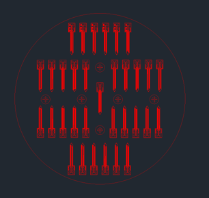  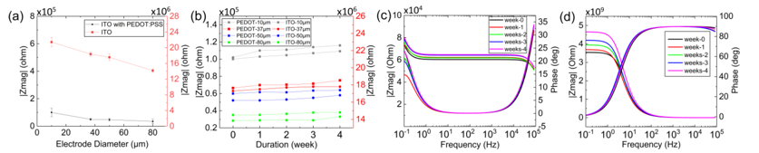 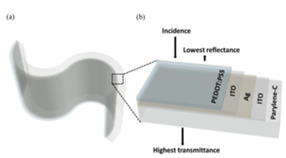 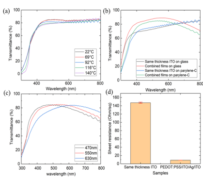

**BDD Probes**
 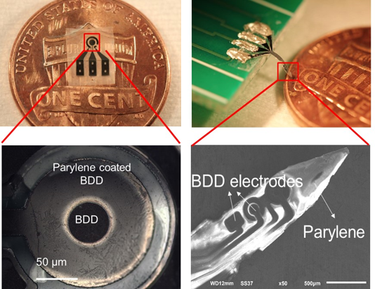 \
  

**IOP Sensor**
 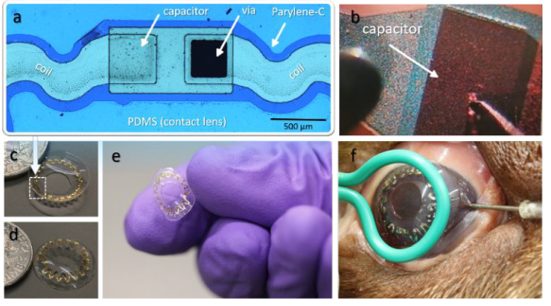 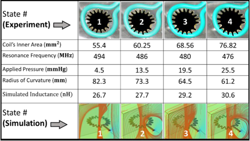

**Microbial Fuel Cell**
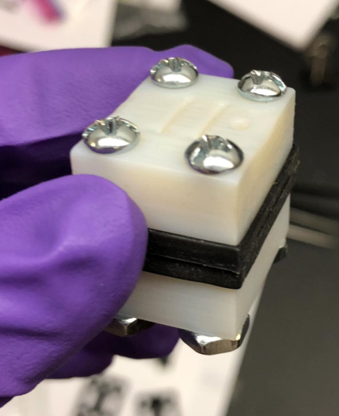 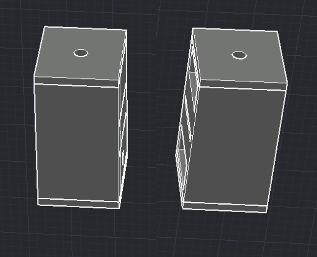 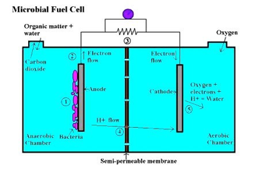

**Bio-cell**
 

**Carbon Ink Printed Sensor**
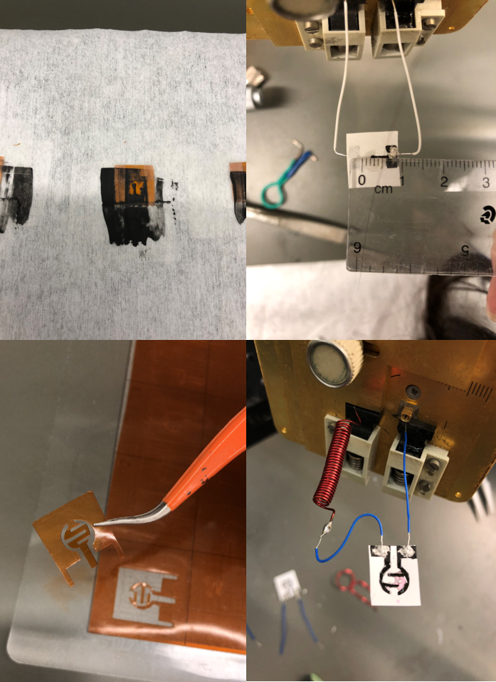  

**Opto-neurostimulator Review**


## IN-CLASS PROJECTS

**Cleanroom Microfabrication**
  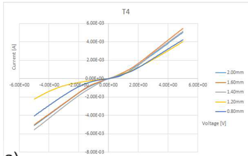


**Computer Aided Manufacturing**


**VLSI**


## Activities

**Teaching Assistant Fall 2017**

[ECE280 Electrical Engineering Analysis](https://github.com/Jia-meow/jia-meow.github.io/raw/master/ECE280-syllabus-FS17-001.pdf)                                                                                               

* Assisted students with MATLAB Problems

* Answered the homework and exam questions during office hour or via email

**ECE Main Office faculty**

* Managed keys of the study rooms

* Answered the common questions that ECE students have

* Organized the feedback documents from classes

**Campus Animal Resources**

* Fed and controled weight of experimental rodents

* Trained animals to respond to the light
